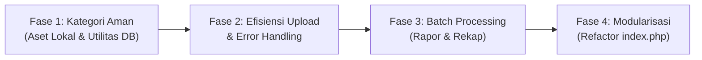

# RENCANA & ROADMAP OPTIMASI ARSITEKTUR SIMAKS

> **Dokumen Rencana Kerja (Action Plan & Roadmap)**
> Panduan terstruktur untuk memperbaiki kelemahan teknis aplikasi SIMAKS secara aman tanpa mengganggu operasional sekolah yang sedang berjalan.

---

## 🎯 TUJUAN & PRINSIP UTAMA
1. **Zero Downtime**: Menjaga operasional belajar-mengajar, absensi, dan ujian tetap berjalan 100% tanpa gangguan.
2. **Prioritas Berbasis Risiko**: Mengutamakan perbaikan aman (risiko nol) terlebih dahulu sebelum refactoring besar.
3. **Rollback Ready**: Setiap perubahan kode memiliki langkah pengembalian (*rollback*) yang jelas jika terjadi kendala.

---

## 🗺️ TAHAPAN PENGERJAAN (ROADMAP)

---

### 🟢 FASE 1: PERBAIKAN AMAN & PENINGKATAN KECEPATAN (ZERO RISK) [SELESAI ✅]
> **Tujuan**: Mempercepat loading aplikasi saat internet lambat dan menyediakan manajemen migrasi DB yang aman.
> **Tingkat Risiko**: 0% (Sangat Aman).

- [x] **1.1. Lokalisasi Aset Eksternal (CDN ke Lokal)**
  - **Uraian**: Mengunduh library dan mengalihkan AdminLTE CSS ke lokal `public/assets/AdminLTE/dist/css/adminlte.min.css`.
  - **Manfaat**: Aplikasi bisa dibuka lebih cepat dan mandiri tanpa ketergantungan CDN eksternal.
  - **File Terkait**: `app/views/partials/header.php`, `app/views/partials/footer.php`.

- [x] **1.2. Pusat Eksekusi Patch Database (Database Patch Runner)**
  - **Uraian**: Menyediakan menu/tombol resmi di menu Admin (*Pengaturan > Utilitas DB*) untuk mendeteksi dan mengeksekusi file `.sql` baru di folder `patch/` atau `sql/` dengan pencatatan riwayat di `app_migrations`.
  - **Manfaat**: AI Agent maupun Administrator di masa depan tidak akan lagi menyisipkan query `INSERT/ALTER` otomatis di dalam view/sidebar.
  - **File Terkait**: `app/models/UtilitasDbModel.php`, `app/controllers/UtilitasDbController.php`, `app/views/utilitas_db_index.php`, `public/index.php`.

---

### 🟡 FASE 2: OPTIMASI PENYIMPANAN & VALIDASI (RISIKO RENDAH) [SELESAI ✅]
> **Tujuan**: Mencegah harddisk server cepat penuh dan menyeragamkan pesan error sistem.
> **Tingkat Risiko**: Rendah.

- [x] **2.1. Kompresi Gambar & Limitasi Ukuran Upload**
  - **Uraian**: Menambahkan kompresi gambar otomatis (JPEG/PNG/WebP dengan penanganan EXIF orientasi kamera) dan membatasi ukuran file upload pada `config/secure_upload.php`.
  - **Manfaat**: Menghemat ruang harddisk server hingga 70-80% dan upload data siswa jadi jauh lebih ringan.
  - **File Terkait**: `config/secure_upload.php`.

- [x] **2.2. Global Exception & Error Handler Standar**
  - **Uraian**: Menyediakan tampilan halaman error modern dan ramah pengguna (`app/views/errors/404.php` dan `500.php`) serta logging terpusat.
  - **Manfaat**: Sistem lebih aman dari kebocoran informasi teknis dan tampilan tetap profesional saat terjadi kendala.
  - **File Terkait**: `public/index.php`, `app/views/errors/404.php`, `app/views/errors/500.php`.

---

### 🟠 FASE 3: OPTIMASI PROSES DATA BESAR (RISIKO SEDANG)
> **Tujuan**: Mencegah server hang saat mencetak ratusan rapor atau mengekspor data massal.
> **Tingkat Risiko**: Sedang (Perlu simulasi pada 1 kelas terlebih dahulu).

- [ ] **3.1. Batch Processing & Pagination Cetak Rapor Massal**
  - **Uraian**: Mengubah sistem cetak rapor PDF massal agar diproses per rombel/kelas (chunked) dengan indikator progress.
  - **Manfaat**: Mencegah error `PHP Memory Limit Exceeded` atau `Maximum Execution Time` saat akhir semester.
  - **File Terkait**: `app/controllers/CetakRaporController.php`, `app/models/CetakRaporModel.php`.

- [ ] **3.2. Optimasi Index Database pada Tabel Transaksional**
  - **Uraian**: Memeriksa dan menambahkan *Database Index* pada kolom-kolom yang sering difilter (seperti `id_ta`, `id_kelas`, `id_siswa`, `tanggal`).
  - **Manfaat**: Query laporan dan rekap nilai ribuan baris menjadi instan.
  - **File Terkait**: Skrip index SQL via menu Utilitas DB.

---

### 🔴 FASE 4: MODULARISASI ROUTING (RISIKO TINGGI - REFACTORING BESAR)
> **Tujuan**: Merapikan 2.100 baris kode di `index.php` menjadi file router modular yang bersih dan mudah dirawat.
> **Tingkat Risiko**: Tinggi (Wajib backup & dikerjakan saat jam libur/malam).

- [ ] **4.1. Backup Total & Lingkungan Uji**
  - **Uraian**: Buat salinan fisik `public/index.php.bak_master` dan ekspor database penuh.
- [ ] **4.2. Pemisahan Route Mapping ke `config/routes.php`**
  - **Uraian**: Memindahkan array mapping modul, segment parameter, dan dispatching controller dari `public/index.php` ke file route terisolasi.
  - **Manfaat**: `public/index.php` menjadi ramping (< 150 baris), aman, dan sangat mudah dibaca oleh developer maupun AI Agent berikutnya.
  - **File Terkait**: `public/index.php`, `config/routes.php`.

---

## 📋 DAFTAR CEK SEBELUM MENGEKSEKUSI SETIAP FASE (SOP)
1. [ ] Pastikan database sudah dicadangkan (`.sql`).
2. [ ] Pastikan tidak ada guru atau siswa yang sedang mengerjakan ujian aktif CBT.
3. [ ] Ikuti panduan arsitektur pada [`AGENTS.md`](file:///d:/BtSoft/wwwroot/simaks.app/AGENTS.md).
4. [ ] Uji fungsi terkait di browser sebelum menandai checklist selesai.

---
*Dokumen ini dapat diperbarui dan dicentang progresnya seiring berjalannya proses optimasi.*
