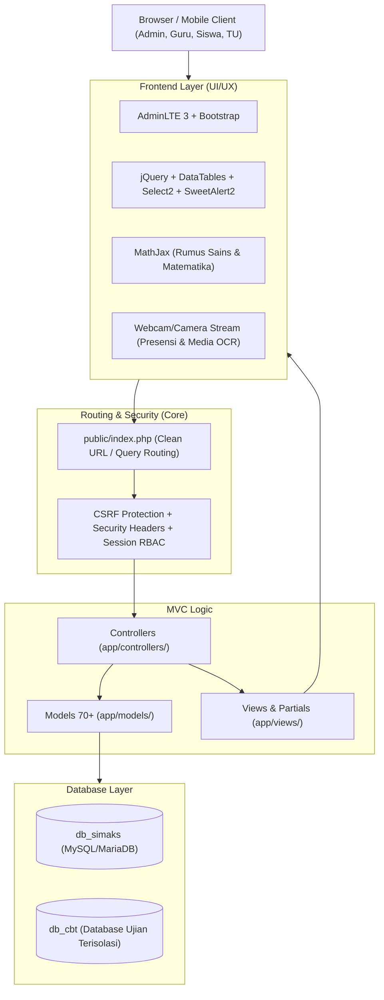

# TENTANG APLIKASI SIMAKS
## (Sistem Informasi Manajemen Akademik Sekolah)

---

## 📖 1. Ikhtisar & Visi Aplikasi
**SIMAKS (Sistem Informasi Manajemen Akademik Sekolah)** adalah platform tata kelola sekolah terpadu (*All-in-One School Management System*) berbasis web yang dirancang untuk mengintegrasikan dan mengotomatisasi seluruh siklus operasional sekolah, mulai dari:
* Penerimaan Peserta Didik Baru (PPDB)
* Manajemen Data Master & Kelembagaan
* Pembelajaran Harian (Jurnal KBM, Absensi, Penilaian)
* E-Learning / Learning Management System (LMS)
* Ujian Berbasis Komputer (Computer Based Test - CBT)
* Bimbingan Konseling (BK) & Usaha Kesehatan Sekolah (UKS)
* Program Kesiswaan & Ekstrakurikuler Unggulan
* Keuangan Sekolah & Penggajian (*Payroll*)
* Portal Publik / Website Profil Sekolah

Aplikasi ini menghubungkan seluruh pemangku kepentingan (*stakeholders*) dalam satu ekosistem: **Kepala Sekolah, Administrator, Tim Kurikulum, Guru/GTK, Tata Usaha, Bendahara, Wali Kelas, Petugas BK/UKS, Siswa, dan Orang Tua/Wali**.

---

## 🏗️ 2. Arsitektur Teknologi (Fullstack Overview)

### A. Backend Layer (Server-Side)
* **Bahasa & Runtime**: **Native PHP 8.x** dengan pola **Model-View-Controller (MVC) Ringan**.
* **Efisiensi Kinerja**: Tanpa *overhead* framework besar, hemat konsumsi memori (RAM), proses eksekusi sangat cepat, dan kompatibel dengan berbagai konfigurasi web server (Apache, Nginx, LiteSpeed, XAMPP, aPanel, cPanel).
* **Smart Dual-Mode Routing**:
  * *Query String*: `?mod=siswa&act=detail&id=5`
  * *Clean URL / RESTful-like Slug*: `/siswa/detail/5` atau `/tugas_tambahan/index/kurikulum`
* **Keamanan Berlapis**:
  * **PDO Prepared Statements** dengan parameter binding pada seluruh model untuk mencegah celah *SQL Injection*.
  * **Role-Based Access Control (RBAC)** dinamis dengan matriks hak akses CRUD (`can_read`, `can_create`, `can_update`, `can_delete`).
  * **Proteksi Sesi Terenkripsi**: Menggunakan cookie flags `HttpOnly`, `SameSite=Lax`, dan `Secure` untuk mencegah *Session Hijacking* dan *XSS*.
  * **Token CSRF** pada pengiriman formulir krusial.

### B. Database Layer (Penyimpanan Data)
* **Koneksi Engine**: PDO MySQL / MariaDB (*utf8mb4* charset).
* **Isolasi Basis Data Ganda (*Dual Database*)**:
  1. `db_simaks`: Database utama untuk seluruh data operasional akademik, administrasi, LMS, kesiswaan, dan keuangan.
  2. `db_cbt`: Database terpisah khusus untuk modul ujian online (CBT) agar beban traffic tinggi (*high concurrent load*) saat ujian berlangsung tidak membebani database operasional sekolah.

### C. Frontend Layer (Client-Side & Antarmuka)
* **Dasar UI/UX**: AdminLTE 3 berbasis Bootstrap dengan kustomisasi tema modern, clean, dan responsif.
* **Mobile-First Experience**: Dilengkapi navigasi bar bawah (*mobile bottom navigation*), modal geser (*sliding modals*), dan layout responsif untuk smartphone.
* **Fitur Interaktif Modern**:
  * **DataTables & Select2**: Pencarian data cepat, filter multi-kolom, dan *server-side/client-side pagination*.
  * **SweetAlert2**: Notifikasi popup modern dan dialog konfirmasi aksi.
  * **MathJax 3**: Engine rendering otomatis untuk rumus matematika, fisika, dan kimia format LaTeX/MathML.
  * **Media & Camera Integration**: Akses kamera bawaan perangkat untuk swafoto absensi mandiri, verifikasi wajah, dan upload berkas.

---

## 📦 3. Peta Modul & Fitur Lengkap

### 1. Data Master & Kelembagaan
* **Profil Sekolah & Identitas**: Pengaturan logo dinamis, kop surat otomatis, visi-misi, dan identitas resmi lembaga.
* **Tahun Ajaran & Semester**: Manajemen tahun ajaran aktif, pergantian semester ganjil/genap, dan penguncian data lampau.
* **Rombongan Belajar (Kelas)**: Manajemen tingkatan kelas, jurusan/program keahlian, dan penugasan wali kelas.
* **Mata Pelajaran & Kurikulum**: Pengaturan struktur kurikulum (Kurikulum Merdeka / K13) dan alokasi jam mengajar.

### 2. Manajemen Kesiswaan & GTK
* **Biodata Siswa Lengkap**: Induk siswa, NISN, NIPD, riwayat pendidikan, data orang tua/wali, dan rekam jejak siswa.
* **Penerimaan Peserta Didik Baru (PPDB)**: Pendaftaran online, seleksi berkas, dan *Re-Generate NIPD Massal* otomatis.
* **Mutasi Siswa**: Penanganan mutasi siswa masuk dan mutasi keluar lengkap dengan cetak surat mutasi resmi.
* **Penugasan GTK (Guru & Tenaga Kependidikan)**: Distribusi penugasan mengajar, tugas tambahan (Wakasek, Kepala Lab, Pembina Ekskul, dll.).

### 3. Akademik & Penilaian
* **Jadwal Pelajaran & Master Jam**: Penyusunan jadwal mengajar mingguan dan salin jadwal antar hari.
* **Jurnal KBM Harian**: Pencatatan materi yang diajarkan, pencapaian kompetensi, dan kendala kelas secara real-time.
* **Sistem Presensi Multi-Tipe**:
  * Presensi Siswa per Jam Pelajaran (Mapel).
  * Presensi Guru & Karyawan (dilengkapi koordinat/kamera).
  * Presensi Guru Piket Harian & Permohonan Izin/Sakit.
* **Capaian & Tujuan Pembelajaran (CP & TP)**: Formulasi TP Kurikulum Merdeka per mapel dan tingkatan.
* **Penilaian Sumatif & Sikap**: Input nilai sumatif materi, asesmen akhir semester (SAS/SAT), dan rekap penilaian sikap/karakter.
* **Cetak Rapor Otomatis**: Generator rapor Kurikulum Merdeka & K13 siap cetak PDF.

### 4. LMS (Learning Management System)
* **Manajemen Materi Belajar**: Distribusi bahan ajar berupa dokumen (PDF/Word), artikel kaya teks, dan video interaktif.
* **Tugas & Proyek Siswa**: Pembuatan tugas terstruktur dengan tenggat waktu (*deadline*).
* **Pengumpulan & Koreksi Online**: Siswa mengunggah berkas jawaban, guru mengoreksi dan memberi feedback serta nilai langsung di aplikasi.

### 5. CBT (Computer Based Test)
* **Bank Soal & Parser Cerdas**: Mendukung pembuatan soal pilihan ganda & esai, termasuk import soal langsung dari berkas Microsoft Word (`.docx`).
* **Ruang Ujian Online**: Dilengkapi timer hitung mundur, auto-save jawaban setiap detik, dan fitur acak urutan soal maupun opsi jawaban.
* **Administrasi Ujian Lengkap**: Cetak otomatis Kartu Peserta Ujian, Berita Acara Ujian, Daftar Hadir, Analisis Butir Soal, dan Kunci Jawaban.

### 6. Layanan Murid & Kesiswaan
* **Bimbingan & Konseling (BK)**: Pencatatan kasus pelanggaran, poin kedisiplinan, tindak lanjut pembinaan, dan panggilan orang tua.
* **Layanan Kesehatan (UKS)**: Buku rekam medis siswa/santri, pencatatan keluhan, riwayat pengobatan, dan stok obat UKS.
* **Program Kesiswaan Unggulan**:
  * Ekstrakurikuler (Ekskul)
  * Kokulikuler (P5 - Penguatan Profil Pelajar Pancasila)
  * Pembiasaan Karakter & Ibadah
  * Program Kewirausahaan Siswa
  * Program Tahfidz Al-Qur'an & Setoran Hafalan
  * *Tracer Study* (Pelacakan Alumni)

### 7. Keuangan Sekolah & Penggajian
* **Billing / Tagihan Siswa**: Penetapan tarif per tingkatan, tagihan bulanan (SPP), uang gedung (DSP), dan tagihan insidental.
* **Penerimaan Pembayaran**: Loket kasir pembayaran, cetak kuitansi resmi, dan kartu rekap pembayaran siswa.
* **Buku Kas & Jurnal Transaksi**: Pencatatan arus kas masuk/keluar, akun rekening bank, dan rekap saldo keuangan.
* **Penggajian (*Payroll*)**: Perhitungan honor mengajar, tunjangan tugas tambahan, potongan kehadiran, dan slip gaji GTK.

### 8. Portal Khusus Siswa
* Antarmuka ramah smartphone khusus siswa untuk memantau jadwal, kehadiran, materi LMS, status tugas, riwayat nilai rapor, dan rincian tagihan secara mandiri.

### 9. Website Profil Sekolah (Landing Page)
* Halaman depan publik sekolah yang dinamis dan terintegrasi langsung dengan database SIMAKS untuk mempublikasikan profil lembaga, program unggulan, video kegiatan, galeri guru, dan berita/pengumuman sekolah.

---

## 🔒 4. Keunggulan Arsitektur & Keamanan
1. **Single Source of Truth**: Seluruh data saling terhubung (misal: data siswa otomatis terhubung ke presensi, nilai, CBT, catatan kesehatan, hingga keuangan).
2. **Kinerja Maksimal & Skalabilitas**: Query database dioptimalkan dengan PDO tanpa beban dependensi yang berat.
3. **Role-Based Flexibility**: Guru dapat mengemban multi-peran secara fleksibel (misal: Guru + Wali Kelas + Pembina Ekskul + Petugas UKS) tanpa konflik akun.
4. **Desain Bersih & Berkelanjutan**: Mengikuti standar arsitektur pada panduan pengembangan `AGENTS.md`.

---
*Dokumen ini dibuat sebagai referensi resmi arsitektur dan kapabilitas sistem SIMAKS.*
